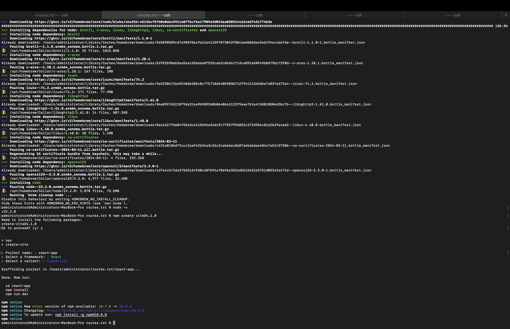
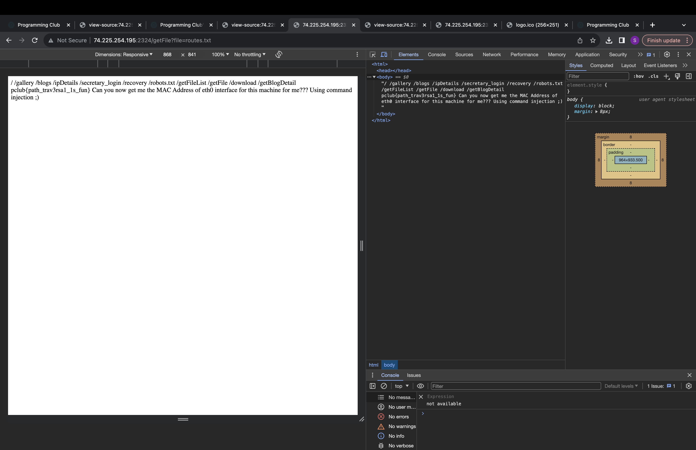
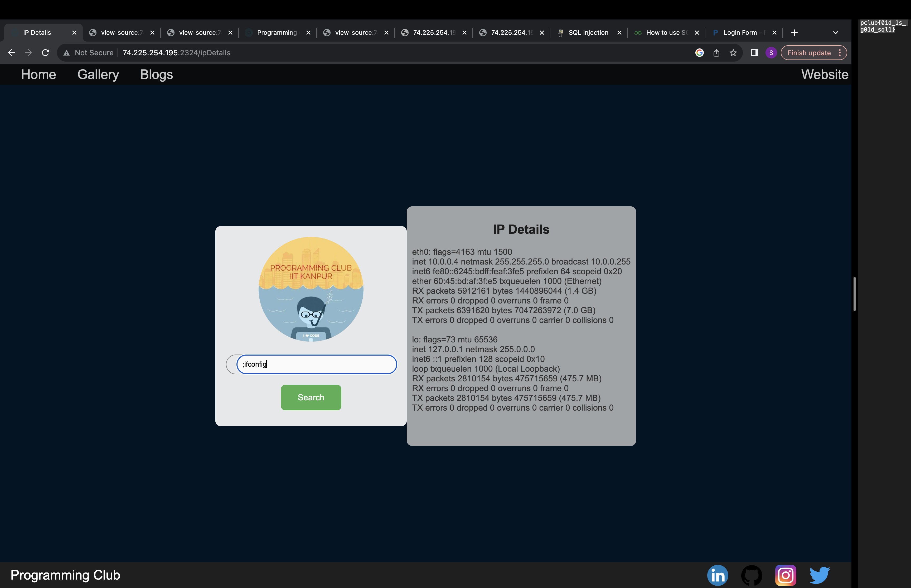
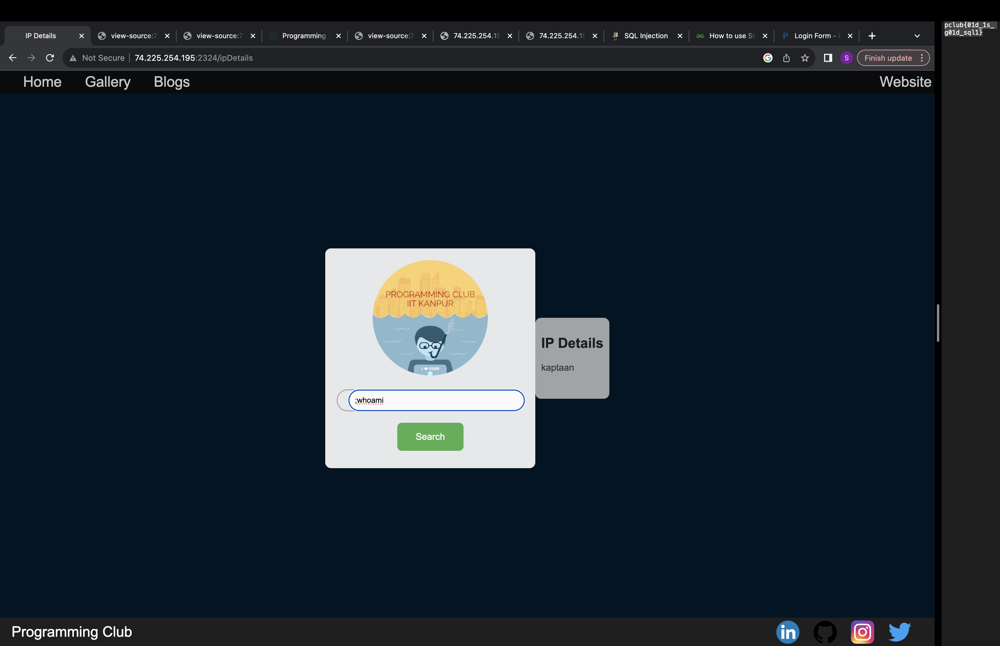

# First Flag ( pclub{path_trav3rsa1_1s_fun} )

As a person who is new to CTF, this was very fascinating as well as frustrating at the same time.
As you mentioned that the file is in the directory, my first aim was to extract all the files in directory and search for routes.txt.
I wasted a good amount of hours on that, probably the whole day 1 and i was not able to find anything.
Later going deep into web exploitation, i realized that there is the getFile function hidden in the source page of gallery.
upon exploiting that and writing file = routes.txt, i found the first flag.
P.S. i did whole brute force , install gobuster and goofuzz only to realise it is of no use(i didnt know what that meant at that time, experience teaches everything)

# Second Flag ( 60:45:bd:af:3f:e5 )

This flag was about getting MAC address.
The website to be used Command injection on was given in routes.txt, i.e. /ipDetails
Upon applying command injection with the IP Address provided in the link, i got some details.
upon searching for command to get MAC address on terminal and cmd, i.e. ifconfig and applying ;ifconfig on the search bar, i got the MAC address of the machine.

# Third Flag ( pclub{01d_1s_g01d_sql1} )

Along with ipDetails, there was one more file which was accessible, i.e. /secretary_details.
A username and password was required to be entered, which showed signs of sql injection
Also typing ;whoami in ipDetails page showed kaptaan, so i knew the username was kaptaan as it was showing incorrect password which was different than others.
Now, using sqlmap for sql injection, i extracted the database tables allowing me the username and hashed passwords (in MD5).
Unhashing the password for kaptaan gave me the third flag.

# Fourth Flag ()

Upon looking at the hints table in databse, it clearly showed that 3 usernames have to be eneterd.
And as per the hint on discord, i found the ariitk hiding in jpeg in amansg22 username.

